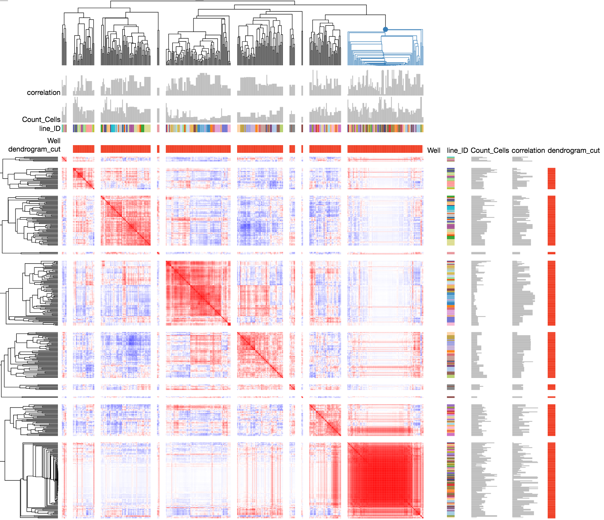
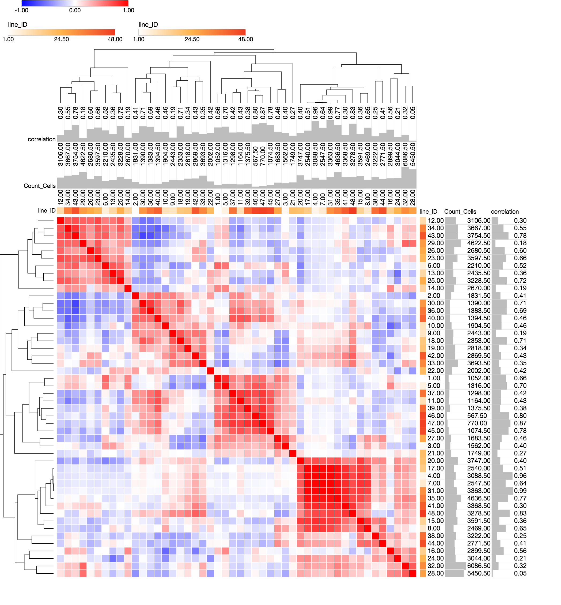

## Load libraries

```{r message=FALSE}
library(ggplot2)
library(glue)
library(magrittr)
library(tidyverse)
```

## Data overview

### Read profiles

Read the 3 sets of profiles - all cells, only isolated, and only colony. 
See `generate-sc-profiles.sh` for details on how the latter two were generated.

```{r message=FALSE}
batch_id <- "2019_06_10_Batch3"

platemap <- "cmQTL_plate1_5.31.2019"

plate_id <- "cmqtlpl1.5-31-2019-mt"

backend_dir <- file.path("..", "..", "..", "backend")

profiles <- 
  read_csv(file.path(backend_dir, batch_id, plate_id, paste0(plate_id, "_normalized_variable_selected.csv")), 
           progress = FALSE)

profiles_isolated <- 
  read_csv(file.path(backend_dir, batch_id, plate_id, paste0(plate_id, "_isolated_normalized_variable_selected.csv")), 
           progress = FALSE)

profiles_colony <- 
  read_csv(file.path(backend_dir, batch_id, plate_id, paste0(plate_id, "_colony_normalized_variable_selected.csv")), 
           progress = FALSE)

```


Each set of profiles will have a different set of features because feature selection was applied separately to each

```{r message=FALSE}

cp_column_match <- "^Cells|^Nuclei|^Cytoplasm"

variables <- str_subset(names(profiles), cp_column_match)

variables_isolated <- str_subset(names(profiles_isolated), cp_column_match)

variables_colony <- str_subset(names(profiles_colony), cp_column_match)

```

Report the size of feature spaces

```{r}
tribble(~profile_type, ~feature_space,
        "all", length(variables),
        "isolated", length(variables_isolated),
        "colony", length(variables_colony)
)
```

```{r}
profiles %>% select(matches("Metadata_")) %>% head()
```

### How many replicates?

Report based on metadata

```{r}
metadata_dir <- file.path("..", "..", "..", "metadata")

metadata <- read_tsv(file.path(metadata_dir, batch_id, "platemap", paste0(platemap, ".txt")))

metadata %<>%
  rename(
  Metadata_Plate_Map_Name = plate_map_name,
  Metadata_Well = well_position,
  Metadata_plating_density = plating_density,
  Metadata_line_ID = line_ID
) %>%
  mutate(
    Metadata_Plate = "cmqtlpl1.5-31-2019-mt"
  )

metadata %>% 
  group_by(Metadata_line_ID) %>%
  tally()
```

Report based on profiles (should be identical)

```{r}
replicates_per_line <- 
  profiles %>%
  group_by(Metadata_Plate, Metadata_line_ID) %>%
  tally()

replicates_per_line
```

Verify that the number of replicates are same for colony and isolated profiles

```{r}
compare::compare(
  profiles_isolated %>%
    group_by(Metadata_Plate, Metadata_line_ID) %>%
    tally(),
  replicates_per_line,
  allowAll = TRUE
)

compare::compare(
  profiles_colony %>%
    group_by(Metadata_Plate, Metadata_line_ID) %>%
    tally(),
  replicates_per_line,
  allowAll = TRUE
)

```

### Audits

What is the median replicate correlation for each cell line? Do this across all types of profiles

```{r message=FALSE}

audit_detailed_all <- tibble()

audit_all <- tibble()

audit_dir <- file.path("..", "..", "..", "audit")

for (profile_type_i in c("_colony", "_isolated", "")) {
  audit <- read_csv(
    glue(
      file.path(audit_dir, batch_id, "{platemap}_audit{profile_type_i}.csv"),
      profile_type_i = profile_type_i
    )
  )
  
  audit_detailed <- read_csv(
    glue(
      file.path(audit_dir, batch_id, "{platemap}_audit{profile_type_i}_detailed.csv"),
      profile_type_i = profile_type_i
    )
  )
  
  audit_detailed_all <- 
    bind_rows(audit_detailed_all,
              audit_detailed %>% mutate(profile_type = profile_type_i))
  audit_all <- 
    bind_rows(audit_all,
              audit %>% mutate(profile_type = profile_type_i))
  
}

p <-
  ggplot(audit_detailed_all,
         aes(correlation)) +
  geom_histogram(binwidth = .03) +
  geom_vline(aes(xintercept = null_threshold), audit_all) +
  xlab("Median pearson correlation between replicates") +
  facet_wrap(~profile_type, ncol = 1) +
  ggtitle(
    "Distribution of replicate correlation across all cell lines",
    subtitle = "Vertical line indicates 95th percentile of null distribution."
  )

print(p)

ggsave(file.path("figures", 
                 glue("{plate_id}_replicate_correlation.png")), 
       p, width = 8, height = 8)
  
```

## Is cell plating density correlated with the order of plating a cell line?

### Display platemap

```{r}
p <- 
  platetools::raw_map(data =
                      as.character(profiles$Metadata_line_ID),
                      well = profiles$Metadata_Well,
                      plate = 384) +
  ggtitle(platemap) +
  theme_dark() +
  scale_fill_discrete()

print(p)

out_file <- file.path("figures", paste0(platemap, ".png"))

ggsave(out_file, p, height = 4, width = 6)
```

### Plot cell counts on plate map

```{r}

# Generate cell counts directly from Image.csv files because the SQLite is too large to load
# 
# find../../../analysis/2019_06_10_Batch3/cmqtlpl1.5-31-2019-mt/analysis/ -name Image.csv -exec csvcut -c Metadata_Well,Count_Cells {} \; > data/count.csv
# cat <(echo Metadata_Well,Count_Cells) <(grep -v "Metadata_Well,Count_Cells" count.csv|sort) > data/cmqtlpl1.5-31-2019-mt_count.csv
# verify that `data/cmqtlpl1.5-31-2019-mt_count.csv` looks right and then delete `data/count.csv`

cell_count <-
  read_csv(file.path("data", paste0(plate_id, "_count.csv"))) %>%
  group_by(Metadata_Plate, Metadata_Well) %>%
  summarize(Count_Cells = sum(Count_Cells))

cell_count %<>%
  inner_join(
    metadata,
    by = c("Metadata_Plate", "Metadata_Well")
  )
  
p <- 
  platetools::raw_map(data =
                      cell_count$Count_Cells,
                      well = cell_count$Metadata_Well,
                      plate = 384) +
  
  ggtitle(glue("{plate_id} cell counts")) +
  theme_dark() +
  scale_fill_continuous()

print(p)
```

### Plot cell count vs cell id

The cell line id corresponds to the order in which the cells were plated. 
We suspected that a longer settling time (i.e. smaller value of cell line id) was resulting in higher cell count.

```{r}
p <- 
  ggplot(cell_count, 
         aes(Metadata_line_ID, Count_Cells)) + 
  geom_boxplot(aes(as.factor(Metadata_line_ID), Count_Cells)) + 
  geom_smooth(method = "lm") +
  xlab("cell line") + 
  ylab("cell count") +
  ggtitle(glue("Relationship between cell line id and cell count ({plate_id})"),
          subtitle = sprintf("Pearson correlation = %.2f",
                             with(cell_count, cor(Count_Cells, Metadata_line_ID))
                             )
          )

p

ggsave(file.path("figures", 
                 glue("{plate_id}_cell_counts_across_replicates.png")), 
       p, width = 8, height = 5)
```

## Is median replicate correlation correlated with other factors?


```{r}
df <-
  audit_detailed_all %>%
  inner_join(
    cell_count %>%
      cytominer::aggregate(
        variables = c("Count_Cells"),
        strata = c("Metadata_line_ID", "Metadata_plating_density"),
        operation = "median"
      ),
    by = c("Metadata_line_ID", "Metadata_plating_density")
  )
```

### Is median replicate correlation correlated with cell id?

```{r}
p <-
  ggplot(audit_detailed_all,
         aes(Metadata_line_ID, correlation)) +
  geom_point() +
  geom_smooth(method = "lm") +
  theme_bw() +
  xlab("cell line") +
  ylab("Median pearson correlation between replicates") +
  facet_wrap(~profile_type, nrow = 1) +
  ggtitle("Relationship between cell line id and replicate correlation (cmqtlpl1.5-31-2019-mt)")

p

audit_detailed_all %>%
  group_by(profile_type) %>%
  summarize(`Pearson corr. between cell line id and replicate correlation` = cor(correlation, Metadata_line_ID)) 
```


### Is median replicate correlation correlated with cell count?

```{r}
p <-
  ggplot(df,
         aes(Count_Cells, correlation)) +
  geom_point() +
  theme_bw() +
  geom_smooth(method = "lm") +
  xlab("Cell count") +
  ylab("Median pearson correlation between replicates") +
  facet_wrap(~profile_type, nrow = 1) +
  ggtitle("Relationship between cell count and replicate correlation (cmqtlpl1.5-31-2019-mt)")

p

df %>%
  group_by(profile_type) %>%
  summarize(`Pearson corr. between cell count and replicate correlation` = cor(Count_Cells, correlation))
```

### Attach cell count and replicate correlation to profiles and save gct

TODO: Create a function to simplify

```{r}
# It becomes messier to use a single data frame for all profiles this point onwards, so repeat code chunks for each profile type
# (perhaps storing them in a list would make it easier to loop, but skipping that for now)

augmented_profiles <-
  profiles %>% 
  inner_join(df %>% filter(profile_type == ""),
             c("Metadata_Plate_Map_Name", "Metadata_plating_density", "Metadata_line_ID")) %>%
  rename(Metadata_correlation = correlation,
         Metadata_Count_Cells = Count_Cells) %>%
  select(matches("^Metadata_"), everything())

augmented_profiles_isolated <-
  profiles %>% 
  inner_join(df %>% filter(profile_type == "_isolated"),
             c("Metadata_Plate_Map_Name", "Metadata_plating_density", "Metadata_line_ID")) %>%
  rename(Metadata_correlation = correlation,
         Metadata_Count_Cells = Count_Cells) %>%
  select(matches("^Metadata_"), everything())

augmented_profiles_colony <-
  profiles %>% 
  inner_join(df %>% filter(profile_type == "_colony"),
             c("Metadata_Plate_Map_Name", "Metadata_plating_density", "Metadata_line_ID")) %>%
  rename(Metadata_correlation = correlation,
         Metadata_Count_Cells = Count_Cells) %>%
  select(matches("^Metadata_"), everything())

augmented_profiles %>%
 write_csv(file.path(backend_dir, batch_id, plate_id, paste0(plate_id, "_normalized_variable_selected_augmented.csv")))

augmented_profiles_isolated %>%
 write_csv(file.path(backend_dir, batch_id, plate_id, paste0(plate_id, "_isolated_normalized_variable_selected_augmented.csv")))

augmented_profiles_colony %>%
 write_csv(file.path(backend_dir, batch_id, plate_id, paste0(plate_id, "_colony_normalized_variable_selected_augmented.csv")))

```


```{sh}
cd ../../cytominer_scripts

Rscript csv2gct.R \
  ../../backend/2019_06_10_Batch3/cmqtlpl1.5-31-2019-mt/cmqtlpl1.5-31-2019-mt_normalized_variable_selected_augmented.csv \
  -o ../../backend/2019_06_10_Batch3/cmqtlpl1.5-31-2019-mt/cmqtlpl1.5-31-2019-mt_normalized_variable_selected_augmented.gct

Rscript csv2gct.R \
  ../../backend/2019_06_10_Batch3/cmqtlpl1.5-31-2019-mt/cmqtlpl1.5-31-2019-mt_isolated_normalized_variable_selected_augmented.csv \
  -o ../../backend/2019_06_10_Batch3/cmqtlpl1.5-31-2019-mt/cmqtlpl1.5-31-2019-mt_isolated_normalized_variable_selected_augmented.gct

Rscript csv2gct.R \
  ../../backend/2019_06_10_Batch3/cmqtlpl1.5-31-2019-mt/cmqtlpl1.5-31-2019-mt_colony_normalized_variable_selected_augmented.csv \
  -o ../../backend/2019_06_10_Batch3/cmqtlpl1.5-31-2019-mt/cmqtlpl1.5-31-2019-mt_colony_normalized_variable_selected_augmented.gct

cd -
```

### Plot median replicate correlation on a plate map

TODO: Create a function to simplify

```{r}

profile_type_i <- "all"

augmented_profiles_i <- augmented_profiles

p <-
  platetools::raw_map(
    data = augmented_profiles_i$Metadata_correlation,
    well = augmented_profiles_i$Metadata_Well,
    plate = 384
  ) +
  ggtitle(
      glue("{plate_id} Median replicate correlation ({profile_type_i})")
  ) +
  theme_dark() +
  scale_fill_continuous()

print(p)
  
profile_type_i <- "colony"

augmented_profiles_i <- augmented_profiles_colony

p <-
  platetools::raw_map(
    data = augmented_profiles_i$Metadata_correlation,
    well = augmented_profiles_i$Metadata_Well,
    plate = 384
  ) +
  ggtitle(
      glue("{plate_id} Median replicate correlation ({profile_type_i})")
  ) +
  theme_dark() +
  scale_fill_continuous()

print(p)
  
profile_type_i <- "isolated"

augmented_profiles_i <- augmented_profiles_isolated

p <-
  platetools::raw_map(
    data = augmented_profiles_i$Metadata_correlation,
    well = augmented_profiles_i$Metadata_Well,
    plate = 384
  ) +
  ggtitle(
      glue("{plate_id} Median replicate correlation ({profile_type_i})")
  ) +
  theme_dark() +
  scale_fill_continuous()

print(p)
```


## Does cell plating density drive similarities?

### Aggregate profiles and cell counts, grouping by cell line and plating density

TODO: Create a function to simplify

```{r}
variables <- str_subset(names(profiles), cp_column_match)

profiles %<>%
  cytominer::aggregate(variables = variables, 
                       strata = c("Metadata_line_ID", "Metadata_plating_density"),
                       operation = "median")

variables_colony <- str_subset(names(profiles_colony), cp_column_match)

profiles_colony %<>%
  cytominer::aggregate(variables = variables_colony, 
                       strata = c("Metadata_line_ID", "Metadata_plating_density"),
                       operation = "median")

variables_isolated <- str_subset(names(profiles_isolated), cp_column_match)

profiles_isolated %<>%
  cytominer::aggregate(variables = variables_isolated, 
                       strata = c("Metadata_line_ID", "Metadata_plating_density"),
                       operation = "median")


cell_count %<>%
  cytominer::aggregate(variables = c("Count_Cells"), 
                       strata = c("Metadata_line_ID", "Metadata_plating_density"),
                       operation = "median")
  
```

### Measure similarity between profiles

```{r}
measure_profile_similarity <- function(profiles) {
  # get data matrix
  data_matrix <-
    profiles %>%
    select(-matches("Metadata"))
  
  # get metadata
  metadata <-
    profiles %>%
    select(matches("Metadata")) %>%
    rowid_to_column(var = "id")
  
  # measure similarities between treatments
  similarity_i <- cor(t(data_matrix)) 
  
  colnames(similarity_i) <- seq(1, ncol(similarity_i))
  
  similarity_i %<>% 
    as_tibble() %>% 
    rowid_to_column(var = "id1") %>% 
    gather(id2, correlation, -id1) %>% 
    mutate(id2 = as.integer(id2)) %>%
    filter(id1 > id2) %>% 
    arrange(desc(correlation))
  
  # annotate the similarities data frame
  similarity_i %<>%
    inner_join(metadata %>% 
                 select(id, 
                        Metadata_line_ID,
                        Metadata_plating_density), 
               by = c("id1" = "id")) %>% 
    rename(Metadata_line_ID1 = Metadata_line_ID, 
           Metadata_plating_density1 = Metadata_plating_density)  %>%
    inner_join(metadata %>% 
                 select(id, 
                        Metadata_line_ID,
                        Metadata_plating_density), 
               by = c("id2" = "id")) %>%
    rename(Metadata_line_ID2 = Metadata_line_ID, 
           Metadata_plating_density2 = Metadata_plating_density) %>% 
    arrange(desc(correlation))
}

similarity <- measure_profile_similarity(profiles)

similarity_colony <- measure_profile_similarity(profiles_colony)

similarity_isolated <- measure_profile_similarity(profiles_isolated)

```

### Measure *absolute difference* of cell counts between profiles

```{r}
# get data matrix
data_matrix <-
  cell_count %>%
  select(-matches("Metadata"))

# get metadata
metadata <-
  cell_count %>%
  select(matches("Metadata")) %>%
  rowid_to_column(var = "id")

# measure similarities between treatments
count_similarity <- abs(outer(data_matrix$Count_Cells, data_matrix$Count_Cells, FUN = "-"))

colnames(count_similarity) <- seq(1, ncol(count_similarity))

count_similarity %<>% 
  as_tibble() %>% 
  rowid_to_column(var = "id1") %>% 
  gather(id2, cell_count_abs_diff, -id1) %>% 
  mutate(id2 = as.integer(id2)) %>%
  filter(id1 > id2) %>% 
  arrange(desc(cell_count_abs_diff))

# annotate the similarities data frame
count_similarity %<>%
  inner_join(metadata %>% 
               select(id, 
                      Metadata_line_ID,
                      Metadata_plating_density), 
             by = c("id1" = "id")) %>% 
  rename(Metadata_line_ID1 = Metadata_line_ID, 
         Metadata_plating_density1 = Metadata_plating_density)  %>%
  inner_join(metadata %>% 
               select(id, 
                      Metadata_line_ID,
                      Metadata_plating_density), 
             by = c("id2" = "id")) %>%
  rename(Metadata_line_ID2 = Metadata_line_ID, 
         Metadata_plating_density2 = Metadata_plating_density) %>% 
  arrange(desc(cell_count_abs_diff))
```

### Measure *average* of cell counts of pairs of profiles

```{r}
# get data matrix
data_matrix <-
  cell_count %>%
  select(-matches("Metadata"))

# get metadata
metadata <-
  cell_count %>%
  select(matches("Metadata")) %>%
  rowid_to_column(var = "id")

# measure similarities between treatments
count_sum <- abs(outer(data_matrix$Count_Cells, data_matrix$Count_Cells,FUN = "+"))

colnames(count_sum) <- seq(1, ncol(count_sum))

count_sum %<>% 
  as_tibble() %>% 
  rowid_to_column(var = "id1") %>% 
  gather(id2, cell_count_sum, -id1) %>% 
  mutate(id2 = as.integer(id2)) %>%
  filter(id1 > id2) %>% 
  arrange(desc(cell_count_sum))

# annotate the similarities data frame
count_sum %<>%
  inner_join(metadata %>% 
               select(id, 
                      Metadata_line_ID,
                      Metadata_plating_density), 
             by = c("id1" = "id")) %>% 
  rename(Metadata_line_ID1 = Metadata_line_ID, 
         Metadata_plating_density1 = Metadata_plating_density)  %>%
  inner_join(metadata %>% 
               select(id, 
                      Metadata_line_ID,
                      Metadata_plating_density), 
             by = c("id2" = "id")) %>%
  rename(Metadata_line_ID2 = Metadata_line_ID, 
         Metadata_plating_density2 = Metadata_plating_density) %>% 
  arrange(desc(cell_count_sum))
```

### Combine profiles similarity and cell count similarity into a single data frame

Note that the cell counts here are that of all cells from the well, not that of each profile type
(i.e. we don't computer cell counts for `isolated` and `colony`, we just use the cell counts for the whole well)
We should revisit whether this is the right approach.

```{r}
combine_similarities <- function(similarity_i) {
  similarity_i %<>% 
    inner_join(count_similarity,
               by = c("id1", 
                      "id2", 
                      "Metadata_line_ID1", 
                      "Metadata_plating_density1", 
                      "Metadata_line_ID2", 
                      "Metadata_plating_density2")) %>%
  inner_join(count_sum,
               by = c("id1", 
                      "id2", 
                      "Metadata_line_ID1", 
                      "Metadata_plating_density1", 
                      "Metadata_line_ID2", 
                      "Metadata_plating_density2")) 
} 

similarity %<>% combine_similarities()

similarity_colony %<>% combine_similarities()

similarity_isolated %<>% combine_similarities()

```

### Report relationship between profiles similarity and cell count similarity

```{r} 
p <-
  ggplot(similarity, aes(correlation, cell_count_abs_diff, color = cell_count_sum)) +
  geom_point() +
  xlab("Pearson correlation between profiles") +
  ylab("Abs. difference between cell counts") +
  xlim(-1.1, 1.1) +
  ggtitle("Relationship between profiles similarity and cell count similarity (all)",
          subtitle = sprintf("Pearson correlation = %.3f",
                             with(similarity, cor(correlation, cell_count_abs_diff))
                             )
          )

p

p <- 
  ggplot(similarity_colony, aes(correlation, cell_count_abs_diff, color = cell_count_sum)) + 
  geom_point() +
  xlab("Pearson correlation between profiles") +
  ylab("Abs. difference between cell counts") +
  xlim(-1.1, 1.1) +
  ggtitle("Relationship between profiles similarity and cell count similarity (colony)",
          subtitle = sprintf("Pearson correlation = %.3f",
                             with(similarity_colony, cor(correlation, cell_count_abs_diff))
                             )
          )

p

p <- 
  ggplot(similarity_isolated, aes(correlation, cell_count_abs_diff, color = cell_count_sum)) + 
  geom_point() +
  xlab("Pearson correlation between profiles") +
  ylab("Abs. difference between cell counts") +
  xlim(-1.1, 1.1) +
  ggtitle("Relationship between profiles similarity and cell count similarity (isolated)",
          subtitle = sprintf("Pearson correlation = %.3f",
                             with(similarity_isolated, cor(correlation, cell_count_abs_diff))
                             )
          )

p
```

## Clustering analysis via Morpheus

Load ../../../backend/2019_06_10_Batch3/cmqtlpl1.5-31-2019-mt/cmqtlpl1.5-31-2019-mt_normalized_variable_selected_augmented.gct in https://software.broadinstitute.org/morpheus/ and cluster

```{r}

```





### Inspect the tight cluster

```{r}
tight_cluster <- 
  CePa::read.gct("figures/morpheus/tight_cluster.gct") %>%
  as_data_frame() 

tight_cluster <- 
  tight_cluster[2,] %>% 
  gather(k, v) %>% 
  filter(v != "na") %>% 
  extract2("v") 

all_wells <- platetools::num_to_well(1:384, plate = 384)

tight_cluster_flag <- all_wells %in% tight_cluster

p <- 
  platetools::raw_map(data = tight_cluster_flag,
                      well = all_wells,
                      plate = 384) +
  ggtitle("Which wells are in the tight cluster?") +
  theme_dark() +
  scale_fill_discrete()

print(p)
```

