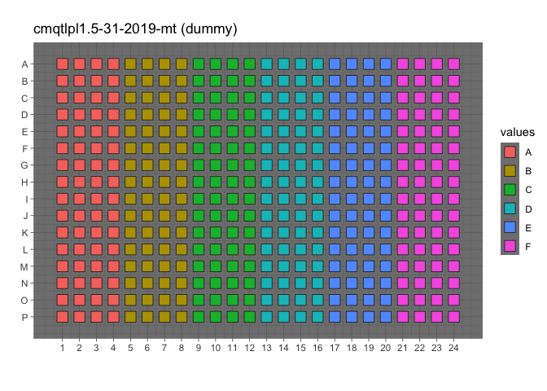

Inspect profiles
================
Gregory Way and Shantanu Singh
June 2019

## Load libraries

``` r
library(ggplot2)
library(magrittr)
library(tidyverse)
```

## Read profiles

Load pilot data for
testing

``` r
profiles <- read_csv("../../../backend/PILOT_1/BR00098071/BR00098071_normalized_variable_selected.csv", progress = FALSE)

variables <- str_subset(names(profiles), "^Cells|^Nuclei|^Cytoplasm")
```

``` r
profiles %<>% 
  rename(Metadata_line_ID = Metadata_cell_line) %>%
  rename(Metadata_plating_density = Metadata_seeding_density_level) %>%
  select(Metadata_Plate, Metadata_Well, Metadata_line_ID, Metadata_plating_density, one_of(variables))
  
profiles %>% select(matches("Metadata_")) %>% head()
```

    ## # A tibble: 6 x 4
    ##   Metadata_Plate Metadata_Well Metadata_line_ID Metadata_plating_density
    ##   <chr>          <chr>         <chr>                               <dbl>
    ## 1 BR00098071     A01           A                                       1
    ## 2 BR00098071     A02           A                                       2
    ## 3 BR00098071     A03           A                                       3
    ## 4 BR00098071     A04           A                                       4
    ## 5 BR00098071     A05           B                                       4
    ## 6 BR00098071     A06           B                                       3

## How many replicates?

``` r
profiles %>%
  group_by(Metadata_Plate, Metadata_line_ID) %>%
  tally()
```

    ## # A tibble: 6 x 3
    ## # Groups:   Metadata_Plate [?]
    ##   Metadata_Plate Metadata_line_ID     n
    ##   <chr>          <chr>            <int>
    ## 1 BR00098071     A                   64
    ## 2 BR00098071     B                   64
    ## 3 BR00098071     C                   64
    ## 4 BR00098071     D                   64
    ## 5 BR00098071     E                   64
    ## 6 BR00098071     F                   64

``` r
profiles0 <- profiles %>% filter(Metadata_Plate == "BR00098071")

p <- 
  platetools::raw_map(data =
                        profiles$Metadata_line_ID,
                      well = profiles$Metadata_Well,
                      plate = 384) +
  ggtitle("cmqtlpl1.5-31-2019-mt (dummy)") +
  theme_dark() +
  scale_fill_discrete()

print(p)
```

<!-- -->

``` r
out_file <- file.path("figures", "cmqtlpl1.5-31-2019-mt_layout.png")
ggsave(out_file, p, height = 4, width = 6)
```
