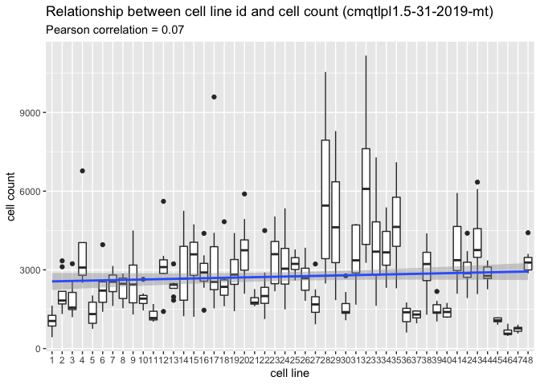

Inspect profiles
================
Gregory Way and Shantanu Singh
June 2019

## Load libraries

``` r
library(ggplot2)
library(magrittr)
library(tidyverse)
```

## Data overview

### Read profiles

Load pilot data for testing (this will be swapped out for the real
data)

``` r
profiles <- read_csv("../../../backend/2019_06_10_Batch3/cmqtlpl1.5-31-2019-mt_normalized_variable_selected.csv", progress = FALSE)

variables <- str_subset(names(profiles), "^Cells|^Nuclei|^Cytoplasm")
```

``` r
# profiles %<>% 
#   mutate(Metadata_line_ID = recode(Metadata_cell_line,
#                                    "A" = 1, "B" = 2, "C" = 3, "D" = 4, "E" = 5, "F" = 6)) %>%
#   rename(Metadata_plating_density = Metadata_seeding_density_level) %>%
#   select(Metadata_Plate, Metadata_Well, Metadata_line_ID, Metadata_plating_density, one_of(variables))
#   

profiles %>% select(matches("Metadata_")) %>% head()
```

    ## # A tibble: 6 x 7
    ##   Metadata_Plate Metadata_Well Metadata_Assay_… Metadata_Plate_…
    ##   <chr>          <chr>         <chr>            <chr>           
    ## 1 cmqtlpl1.5-31… A01           cmqtlpl1.5-31-2… cmQTL_plate1_5.…
    ## 2 cmqtlpl1.5-31… A02           cmqtlpl1.5-31-2… cmQTL_plate1_5.…
    ## 3 cmqtlpl1.5-31… A03           cmqtlpl1.5-31-2… cmQTL_plate1_5.…
    ## 4 cmqtlpl1.5-31… A04           cmqtlpl1.5-31-2… cmQTL_plate1_5.…
    ## 5 cmqtlpl1.5-31… A05           cmqtlpl1.5-31-2… cmQTL_plate1_5.…
    ## 6 cmqtlpl1.5-31… A06           cmqtlpl1.5-31-2… cmQTL_plate1_5.…
    ## # … with 3 more variables: Metadata_well_position <chr>,
    ## #   Metadata_plating_density <dbl>, Metadata_line_ID <dbl>

### How many replicates?

``` r
metadata <- read_tsv("../../../metadata/2019_06_10_Batch3/platemap/cmQTL_plate1_5.31.2019.txt")
```

    ## Parsed with column specification:
    ## cols(
    ##   plate_map_name = col_character(),
    ##   well_position = col_character(),
    ##   plating_density = col_double(),
    ##   line_ID = col_double()
    ## )

``` r
metadata %<>%
  rename(
  Metadata_Plate_Map_Name = plate_map_name,
  Metadata_Well = well_position,
  Metadata_plating_density = plating_density,
  Metadata_line_ID = line_ID
) %>%
  mutate(
    Metadata_Plate = "cmqtlpl1.5-31-2019-mt"
  )

metadata %>% 
  group_by(Metadata_line_ID) %>%
  tally()
```

    ## # A tibble: 48 x 2
    ##    Metadata_line_ID     n
    ##               <dbl> <int>
    ##  1                1     8
    ##  2                2     8
    ##  3                3     8
    ##  4                4     8
    ##  5                5     8
    ##  6                6     8
    ##  7                7     8
    ##  8                8     8
    ##  9                9     8
    ## 10               10     8
    ## # … with 38 more rows

``` r
profiles %>%
  group_by(Metadata_Plate, Metadata_line_ID) %>%
  tally()
```

    ## # A tibble: 48 x 3
    ## # Groups:   Metadata_Plate [?]
    ##    Metadata_Plate        Metadata_line_ID     n
    ##    <chr>                            <dbl> <int>
    ##  1 cmqtlpl1.5-31-2019-mt                1     8
    ##  2 cmqtlpl1.5-31-2019-mt                2     8
    ##  3 cmqtlpl1.5-31-2019-mt                3     8
    ##  4 cmqtlpl1.5-31-2019-mt                4     8
    ##  5 cmqtlpl1.5-31-2019-mt                5     8
    ##  6 cmqtlpl1.5-31-2019-mt                6     8
    ##  7 cmqtlpl1.5-31-2019-mt                7     8
    ##  8 cmqtlpl1.5-31-2019-mt                8     8
    ##  9 cmqtlpl1.5-31-2019-mt                9     8
    ## 10 cmqtlpl1.5-31-2019-mt               10     8
    ## # … with 38 more rows

## Is cell plating density correlated with the order of plating a cell line?

### Display platemap

``` r
p <- 
  platetools::raw_map(data =
                      as.character(profiles$Metadata_line_ID),
                      well = profiles$Metadata_Well,
                      plate = 384) +
  
  ggtitle("cmqtlpl1.5-31-2019-mt (dummy)") +
  theme_dark() +
  scale_fill_discrete()

print(p)
```

<!-- -->

``` r
out_file <- file.path("figures", "cmqtlpl1.5-31-2019-mt_layout.png")
ggsave(out_file, p, height = 4, width = 6)
```

### Plot cell counts on plate map

``` r
# Generate cell counts directly from Image.csv files because the SQLite is too large to load
# 
# find../../../analysis/2019_06_10_Batch3/cmqtlpl1.5-31-2019-mt/analysis/ -name Image.csv -exec csvcut -c Metadata_Well,Count_Cells {} \; > data/count.csv
# cat <(echo Metadata_Well,Count_Cells) <(grep -v "Metadata_Well,Count_Cells" count.csv|sort) > data/cmqtlpl1.5-31-2019-mt_count.csv
# verify that `data/cmqtlpl1.5-31-2019-mt_count.csv` looks right and then delete `data/count.csv`

cell_count <-
  read_csv("data/cmqtlpl1.5-31-2019-mt_count.csv") %>%
  group_by(Metadata_Plate, Metadata_Well) %>%
  summarize(Count_Cells = sum(Count_Cells))
```

    ## Parsed with column specification:
    ## cols(
    ##   Metadata_Plate = col_character(),
    ##   Metadata_Well = col_character(),
    ##   Count_Cells = col_double()
    ## )

``` r
cell_count %<>%
  inner_join(
    metadata,
    by = c("Metadata_Plate", "Metadata_Well")
  )
  
p <- 
  platetools::raw_map(data =
                      cell_count$Count_Cells,
                      well = cell_count$Metadata_Well,
                      plate = 384) +
  
  ggtitle("cmqtlpl1.5-31-2019-mt cell counts") +
  theme_dark() +
  scale_fill_continuous()

print(p)
```

<!-- -->

### Plot cell count vs cell id

``` r
p <- 
  ggplot(cell_count, 
         aes(Metadata_line_ID, Count_Cells)) + 
  geom_boxplot(aes(as.factor(Metadata_line_ID), Count_Cells)) + 
  geom_smooth(method = "lm") +
  xlab("cell line") + 
  ylab("cell count") +
  ggtitle("Relationship between cell line id and cell count (cmqtlpl1.5-31-2019-mt)",
          subtitle = sprintf("Pearson correlation = %.2f",
                             with(cell_count, cor(Count_Cells, Metadata_line_ID))
                             )
          )

p
```

<!-- -->

## Does cell plating density drive similarities?

### Aggregate profiles and cell counts, grouping by cell line and plating density

``` r
variables <- str_subset(names(profiles), "^Cells|^Nuclei|^Cytoplasm")

profiles %<>%
  cytominer::aggregate(variables = variables, 
                       strata = c("Metadata_line_ID", "Metadata_plating_density"),
                       operation = "median")

cell_count %<>%
  cytominer::aggregate(variables = c("Count_Cells"), 
                       strata = c("Metadata_line_ID", "Metadata_plating_density"),
                       operation = "median")
```

### Measure similarity between profiles

``` r
# get data matrix
data_matrix <-
  profiles %>%
  select(-matches("Metadata"))

# get metadata
metadata <-
  profiles %>%
  select(matches("Metadata")) %>%
  rowid_to_column(var = "id")

# measure similarities between treatments
similarity <- cor(t(data_matrix)) 

colnames(similarity) <- seq(1, ncol(similarity))

similarity %<>% 
  as_tibble() %>% 
  rowid_to_column(var = "id1") %>% 
  gather(id2, correlation, -id1) %>% 
  mutate(id2 = as.integer(id2)) %>%
  filter(id1 > id2) %>% 
  arrange(desc(correlation))

# annotate the similarities data frame
similarity %<>%
  inner_join(metadata %>% 
               select(id, 
                      Metadata_line_ID,
                      Metadata_plating_density), 
             by = c("id1" = "id")) %>% 
  rename(Metadata_line_ID1 = Metadata_line_ID, 
         Metadata_plating_density1 = Metadata_plating_density)  %>%
  inner_join(metadata %>% 
               select(id, 
                      Metadata_line_ID,
                      Metadata_plating_density), 
             by = c("id2" = "id")) %>%
  rename(Metadata_line_ID2 = Metadata_line_ID, 
         Metadata_plating_density2 = Metadata_plating_density) %>% 
  arrange(desc(correlation))
```

### Measure absolute difference between profiles

``` r
# get data matrix
data_matrix <-
  cell_count %>%
  select(-matches("Metadata"))

# get metadata
metadata <-
  cell_count %>%
  select(matches("Metadata")) %>%
  rowid_to_column(var = "id")

# measure similarities between treatments
count_similarity <- abs(outer(data_matrix$Count_Cells, data_matrix$Count_Cells,FUN = "-"))

colnames(count_similarity) <- seq(1, ncol(count_similarity))

count_similarity %<>% 
  as_tibble() %>% 
  rowid_to_column(var = "id1") %>% 
  gather(id2, cell_count_abs_diff, -id1) %>% 
  mutate(id2 = as.integer(id2)) %>%
  filter(id1 > id2) %>% 
  arrange(desc(cell_count_abs_diff))

# annotate the similarities data frame
count_similarity %<>%
  inner_join(metadata %>% 
               select(id, 
                      Metadata_line_ID,
                      Metadata_plating_density), 
             by = c("id1" = "id")) %>% 
  rename(Metadata_line_ID1 = Metadata_line_ID, 
         Metadata_plating_density1 = Metadata_plating_density)  %>%
  inner_join(metadata %>% 
               select(id, 
                      Metadata_line_ID,
                      Metadata_plating_density), 
             by = c("id2" = "id")) %>%
  rename(Metadata_line_ID2 = Metadata_line_ID, 
         Metadata_plating_density2 = Metadata_plating_density) %>% 
  arrange(desc(cell_count_abs_diff))
```

### Combine

``` r
similarity %<>% 
  inner_join(count_similarity,
             by = c("id1", 
                    "id2", 
                    "Metadata_line_ID1", 
                    "Metadata_plating_density1", 
                    "Metadata_line_ID2", 
                    "Metadata_plating_density2"))
```

### Report relationship between profiles similarity and cell count similarity

``` r
p <- 
  ggplot(similarity, aes(correlation, cell_count_abs_diff)) + 
  geom_point() +
  xlab("Pearson correlation between profiles") +
  ylab("Abs. difference between cell counts") +
  ggtitle("Relationship between profiles similarity and cell count similarity",
          subtitle = sprintf("Pearson correlation = %.2f",
                             with(similarity, cor(correlation, cell_count_abs_diff))
                             )
          )

p
```

<!-- -->
