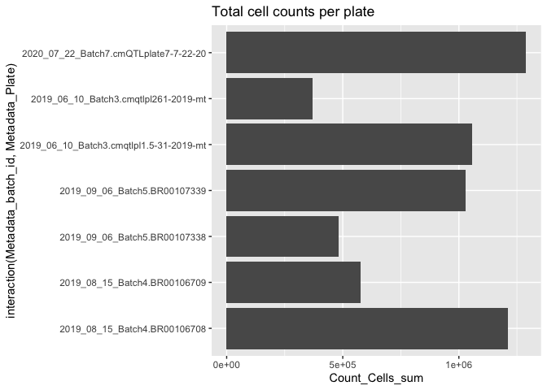

Inspect profiles
================
Shantanu Singh
July 2020

If running interactively in RStudio,

  - change `output` in the header of this markdown to `html_notebook`
    and
  - change to `eval=TRUE` below

When knitting for pushing to GitHub,

  - change `output` in the header of this markdown to `github_document`
    and
  - change to `eval=TRUE` below

<!-- end list -->

``` r
show_table <- knitr::kable
```

``` r
library(ggplot2)
library(glue)
library(magrittr)
library(tidyverse)  
```

    ## ── Attaching packages ───────────────────────────────────────────────────────────────────────────────── tidyverse 1.3.0 ──

    ## ✓ tibble  3.0.1     ✓ dplyr   0.8.5
    ## ✓ tidyr   1.0.2     ✓ stringr 1.4.0
    ## ✓ readr   1.3.1     ✓ forcats 0.5.0
    ## ✓ purrr   0.3.4

    ## ── Conflicts ──────────────────────────────────────────────────────────────────────────────────── tidyverse_conflicts() ──
    ## x dplyr::collapse()  masks glue::collapse()
    ## x tidyr::extract()   masks magrittr::extract()
    ## x dplyr::filter()    masks stats::filter()
    ## x dplyr::lag()       masks stats::lag()
    ## x purrr::set_names() masks magrittr::set_names()

# Read profiles

``` r
batch_metadata <- 
  tribble(~Metadata_fixation_date,~Metadata_batch_id,~Metadata_Plate,
          "2020-07-22","2020_07_22_Batch7","cmQTLplate7-7-22-20",
          "2019-08-27","2019_09_06_Batch5","BR00107338",
          "2019-08-20","2019_09_06_Batch5","BR00107339",
          "2019-08-09","2019_08_15_Batch4","BR00106708",
          "2019-08-05","2019_08_15_Batch4","BR00106709",
          "2019-06-03","2019_06_10_Batch3","cmqtlpl261-2019-mt",
          "2019-05-31","2019_06_10_Batch3","cmqtlpl1.5-31-2019-mt")
```

``` r
plates <- c("BR00106708", 
            "BR00106709", 
            "BR00107338", 
            "BR00107339", 
            "cmqtlpl1.5-31-2019-mt", 
            "cmqtlpl261-2019-mt",
            "cmQTLplate7-7-22-20"
)

plate_id <- plates[[1]]
```

``` r
profiles <- 
  plates %>%
  map_df(~read_csv(file.path("profiles", paste0(.x, "_normalized.csv")), 
                   col_types = cols(
                     .default = col_double(),
                     Metadata_Plate = col_character(),
                     Metadata_Well = col_character(),
                     Metadata_Assay_Plate_Barcode = col_character(),
                     Metadata_Plate_Map_Name = col_character(),
                     Metadata_well_position = col_character()
                   ),
                   progress = FALSE))
```

``` r
cell_counts <- 
  plates %>%
  map_df(~read_csv(file.path("profiles", paste0(.x, "_count.csv")), 
                   col_types = cols(
                     .default = col_double(),
                     Metadata_Plate = col_character(),
                     Metadata_Well = col_character()
                   ),
                   progress = FALSE))
```

``` r
cell_counts %<>% 
  inner_join(profiles %>% 
               select(Metadata_Plate, 
                      Metadata_Well, 
                      Metadata_line_ID)
             ) %>% 
  inner_join(batch_metadata)
```

    ## Joining, by = c("Metadata_Plate", "Metadata_Well")

    ## Joining, by = "Metadata_Plate"

`Metadata_line_ID` are empty wells or those that failed

``` r
profiles %<>%
  filter(Metadata_line_ID != 0)

cell_counts %<>%
  filter(Metadata_line_ID != 0)
```

# Inspect profiles

Across how many plates is each cell line plated?

``` r
cell_counts %>%
  distinct(Metadata_Plate, Metadata_line_ID) %>%
  group_by(Metadata_line_ID) %>%
  tally(name = "n_plates") %>%
  group_by(n_plates) %>%
  tally(name = "n_lines") %>%
  show_table
```

| n\_plates | n\_lines |
| --------: | -------: |
|         1 |      291 |
|         2 |       17 |

List cell lines that are present on more than one plate

``` r
cell_counts %>%
  distinct(Metadata_Plate, Metadata_line_ID) %>%
  group_by(Metadata_line_ID) %>%
  tally(name = "n_plates") %>%
  filter(n_plates == 2) %>%
  inner_join(profiles %>% distinct(Metadata_Plate, Metadata_line_ID)) %>%
  ungroup() %>%
  arrange(Metadata_line_ID) %>%
  show_table
```

    ## Joining, by = "Metadata_line_ID"

| Metadata\_line\_ID | n\_plates | Metadata\_Plate       |
| -----------------: | --------: | :-------------------- |
|                  1 |         2 | cmqtlpl1.5-31-2019-mt |
|                  1 |         2 | cmqtlpl261-2019-mt    |
|                  2 |         2 | cmqtlpl1.5-31-2019-mt |
|                  2 |         2 | cmqtlpl261-2019-mt    |
|                 14 |         2 | cmqtlpl1.5-31-2019-mt |
|                 14 |         2 | cmQTLplate7-7-22-20   |
|                 28 |         2 | cmqtlpl1.5-31-2019-mt |
|                 28 |         2 | cmQTLplate7-7-22-20   |
|                 49 |         2 | BR00106709            |
|                 49 |         2 | cmqtlpl261-2019-mt    |
|                 50 |         2 | BR00106709            |
|                 50 |         2 | cmqtlpl261-2019-mt    |
|                 55 |         2 | cmqtlpl261-2019-mt    |
|                 55 |         2 | cmQTLplate7-7-22-20   |
|                 95 |         2 | BR00106708            |
|                 95 |         2 | BR00106709            |
|                 96 |         2 | BR00106708            |
|                 96 |         2 | BR00106709            |
|                117 |         2 | BR00106709            |
|                117 |         2 | cmQTLplate7-7-22-20   |
|                129 |         2 | BR00106709            |
|                129 |         2 | cmQTLplate7-7-22-20   |
|                141 |         2 | BR00106708            |
|                141 |         2 | BR00107339            |
|                142 |         2 | BR00106708            |
|                142 |         2 | BR00107339            |
|                187 |         2 | BR00107338            |
|                187 |         2 | BR00107339            |
|                188 |         2 | BR00107338            |
|                188 |         2 | BR00107339            |
|                231 |         2 | BR00107339            |
|                231 |         2 | cmQTLplate7-7-22-20   |
|                253 |         2 | BR00107338            |
|                253 |         2 | cmQTLplate7-7-22-20   |

``` r
cell_counts_summary_per_plate <-
  cell_counts %>%
  group_by(Metadata_batch_id, Metadata_Plate) %>%
  summarize(Count_Cells_median = median(Count_Cells),
            Count_Cells_mean = mean(Count_Cells),
            Count_Cells_sum = sum(Count_Cells)
            )

cell_counts_summary_full <-
  cell_counts %>%
  summarize(Count_Cells_median = median(Count_Cells),
            Count_Cells_mean = mean(Count_Cells))
```

``` r
p <-
  ggplot(cell_counts,
         aes(as.factor(Metadata_line_ID), Count_Cells)) +
  geom_boxplot() +
  geom_hline(data = cell_counts_summary_per_plate,
             aes(yintercept = Count_Cells_median),
             color = "red", linetype = "dashed") +
  geom_hline(data = cell_counts_summary_full,
             aes(yintercept = Count_Cells_median),
             color = "blue") +
  facet_wrap(~ Metadata_batch_id ~ Metadata_Plate,
             scales = "free_x",
             ncol = 3) +
  theme(axis.text.x = element_text(angle = 90, hjust = 1)) +
  ylim(c(
    sort(cell_counts$Count_Cells, decreasing = FALSE)[5],
    sort(cell_counts$Count_Cells, decreasing = TRUE)[5]
  )) +
  ggtitle("Cell counts across plates", subtitle = "Red: median per plate, Blue: median across all plates. Top/bottom 5 values across full dataset have been trimmed in this plot.")

#print(p)

ggsave("figures/all_plates_counts_boxplot.pdf",
       p,
       width = 20,
       height = 8)
```

    ## Warning: Removed 8 rows containing non-finite values (stat_boxplot).

``` r
p <-
  ggplot(cell_counts_summary_per_plate,
         aes(interaction(Metadata_batch_id, Metadata_Plate), Count_Cells_sum)) +
  geom_col() +
  coord_flip() +
  ggtitle("Total cell counts per plate")

print(p)
```

<!-- -->

``` r
ggsave("figures/all_plates_counts_sum.pdf",
       p,
       width = 8,
       height = 5)
```
