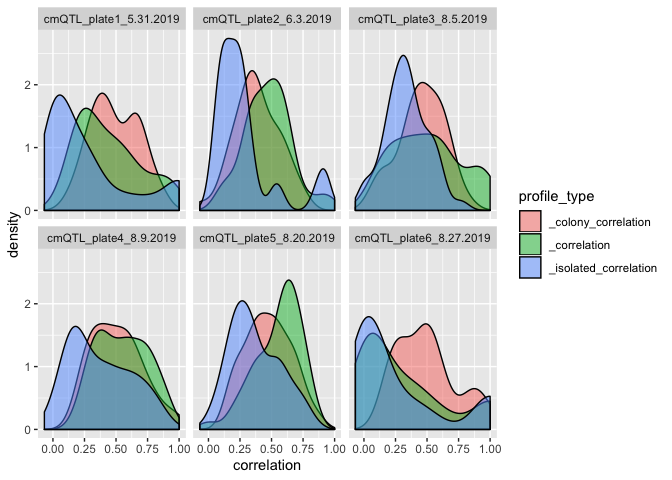
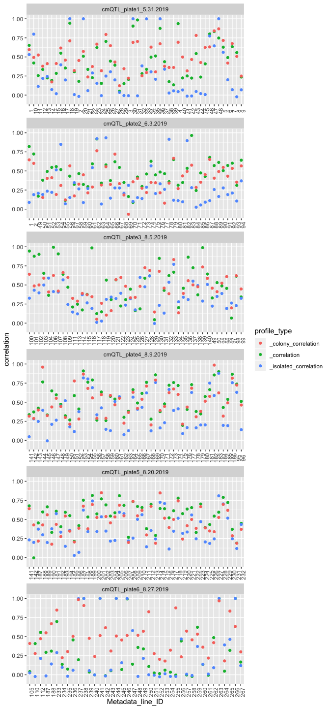

Inspect audits
================

``` r
library(tidyverse)
library(magrittr)
library(glue)
```

Read all the audits

``` r
audits <- tibble()

for(profile_type in c("", "_isolated", "_colony")) {
  profile_type_correlation <- paste0(profile_type, "_correlation")
  
  audit <- 
    c(glue("../../../audit/2019_06_10_Batch3/cmQTL_plate1_5.31.2019_audit{profile_type}_detailed.csv"),
      glue("../../../audit/2019_06_10_Batch3/cmQTL_plate2_6.3.2019_audit{profile_type}_detailed.csv"),
      glue("../../../audit/2019_08_15_Batch4/cmQTL_plate3_8.5.2019_audit{profile_type}_detailed.csv"),
      glue("../../../audit/2019_08_15_Batch4/cmQTL_plate4_8.9.2019_audit{profile_type}_detailed.csv"),
      glue("../../../audit/2019_09_06_Batch5/cmQTL_plate6_8.27.2019_audit{profile_type}_detailed.csv"),
      glue("../../../audit/2019_09_06_Batch5/cmQTL_plate5_8.20.2019_audit{profile_type}_detailed.csv")) %>%
    map_df(read_csv) %>%
    rename(!!profile_type_correlation := correlation)
  
  if (nrow(audits) == 0) {
    audits <- audit
  } else {
    audits %<>% left_join(audit)
  }
}

audits %<>% 
  filter(Metadata_line_ID != 0) %>%
  select(-Metadata_plating_density) %>%
  pivot_longer(matches("correlation"), "profile_type", values_to = "correlation")

audits_full <- audits
```

Plot audits

``` r
ggplot(audits_full, 
       aes(correlation, fill = profile_type)) + 
  geom_density(alpha = 0.5) + 
  facet_wrap(~ Metadata_Plate_Map_Name)
```

    ## Warning: Removed 2 rows containing non-finite values (stat_density).

<!-- -->

``` r
audits_full %>%
  mutate(Metadata_line_ID = as.character(Metadata_line_ID)) %>%
  group_by(Metadata_Plate_Map_Name) %>%
  ggplot(aes(Metadata_line_ID, correlation, color = profile_type)) + 
  geom_point() + 
  facet_wrap(~Metadata_Plate_Map_Name, scales = "free_x", ncol = 1) +
  theme(axis.text.x = element_text(angle = 90))
```

    ## Warning: Removed 2 rows containing missing values (geom_point).

<!-- -->

Report the highest replicate correlation per cell line, across all
profile types. This is a hacky way of ranking cell lines based on
quality.

Save the top 7

``` r
audits_full %>% 
  distinct(Metadata_Plate_Map_Name, Metadata_line_ID) %>%
  group_by(Metadata_line_ID) %>%
  mutate(Metadata_Plate_Rep = row_number(Metadata_Plate_Map_Name)) %>%
  ungroup() %>%
  pivot_wider(Metadata_line_ID, 
              names_from = Metadata_Plate_Rep, 
              values_from = Metadata_Plate_Map_Name,
              names_prefix = "replicate_plate_") %>%
  inner_join(audits %>%
               group_by(Metadata_line_ID) %>% 
               summarize(correlation = max(correlation))
             ) %>%
  arrange(correlation) %>%
  slice(1:7) %>%
  write_csv("data/top_7_cell_lines_to_repeat.csv") %>%
  knitr::kable()
```

| Metadata\_line\_ID | replicate\_plate\_1      | replicate\_plate\_2 | correlation |
| -----------------: | :----------------------- | :------------------ | ----------: |
|                 55 | cmQTL\_plate2\_6.3.2019  | NA                  |   0.1204948 |
|                 28 | cmQTL\_plate1\_5.31.2019 | NA                  |   0.1227875 |
|                117 | cmQTL\_plate3\_8.5.2019  | NA                  |   0.1241144 |
|                129 | cmQTL\_plate3\_8.5.2019  | NA                  |   0.1454407 |
|                253 | cmQTL\_plate6\_8.27.2019 | NA                  |   0.1803551 |
|                231 | cmQTL\_plate5\_8.20.2019 | NA                  |   0.1896863 |
|                 14 | cmQTL\_plate1\_5.31.2019 | NA                  |   0.1936588 |
